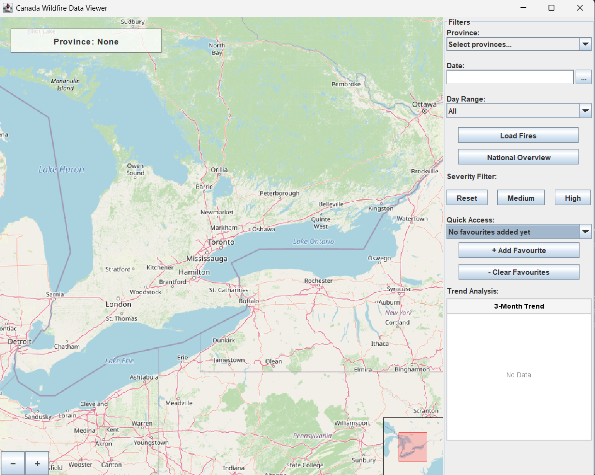

## Group name - WildfireIQ

### Project Domain

| Wildfire Tracker

The goal of this project is to create an interactive software that allows users to view wildfire data across Canada, in order to flag areas that are highly susceptible to wildfire and aid in the development of preventative measures for wildfire spread.

### User Stories
1. As a user, I want to analyse wildfire trends in my province over a range of time
2. As a user, I want to hover over a wildfire marker to see its specifications (latitude-longitude location, number of fires, and fire radiative power)
3. As a user, I am interested in observing trends in size and scale of wildfires in Canada over the past 3 months
4. As a user, I would like to drag around the map to focus on specific areas, and zoom-in to get a close-up view of any one region
5. As a user, I want to filter fires by severity (moderate / high) to focus on areas that are especially susceptible to large-scale fires (determined by Fire Radiation Power)
6. As a user, I want to favourite a location that I can revisit to check for updates at a later time
7. As a user, I want to select multiple provinces to look at cumulative wildfire information

### API Information
-   `FIRMS` : This project uses the NASA Fire Information for Resource Management System (`FIRMS`) with Near Real-Time (NRT) active fire data for the US and Canada, specifically data collected by the NOAA-20 polar-orbiting weather satellite.
- https://firms.modaps.eosdis.nasa.gov/api/
- `nominatim` : For boundaries

### Working Demo
- screenshots or animations demonstrating current functionality

